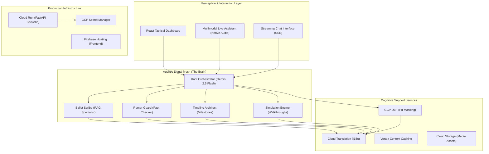

# ElectraLensAI: Multi-Modal Civic Intelligence Mesh (v1.0.0)

ElectraLensAI is a high-fidelity, agentic platform designed to combat electoral misinformation and enhance civic literacy through **decentralized intelligence**. Built on Google's advanced Gemini ecosystem, it fuses multi-modal reasoning with enterprise-grade security to deliver a transparent, non-partisan voting guide for global democracies.

## 🔴 High-Level System Architecture

---

## 🏗️ The Technology Stack

| Layer | Technology | Role |
| :--- | :--- | :--- |
| **Foundation Models** | Gemini 2.5 Pro / Flash | Core reasoning and native multimodal ingestion |
| **Agentic Framework** | Google ADK (Agent Development Kit) | Hierarchical mesh orchestration and tool use |
| **API Backend** | FastAPI (Python 3.12) | Real-time SSE streaming and WebSocket handling |
| **Security Layer** | Google Cloud DLP | Automated PII redaction and sensitive data masking |
| **Frontend UI** | React 18 + Vite + Tailwind | Responsive, high-performance tactical dashboard |
| **Observability** | Cloud Logging / Monitoring | Distributed tracing and agentic performance metrics |
| **Infrastructure** | Cloud Run + Firebase | Serverless, auto-scaling deployment architecture |

---

## 🧠 Strategic Agentic Pillars

### 1. Sequential Mesh Delegation
The **Root Orchestrator** employs intent classification to route queries to specialized sub-agents. Unlike flat chatbots, ElectraLensAI uses a **tiered intelligence model** where the orchestrator manages state while sub-agents focus on domain-specific corpora (Ballot, Timeline, or Rumors).

### 2. Rumor Guard: Real-Time Fact-Checking
The **RumorGuardAgent** utilizes Gemini 2.5 Pro's reasoning capabilities to cross-reference user claims against verified election guidelines. It identifies "Red Flags" in viral misinformation and provides a non-partisan, evidence-based rebuttal.

### 3. Native Multimodal Live (Native Audio)
ElectraLensAI integrates the **Gemini Multimodal Live API**, allowing users to interact with the system via natural voice. The system processes raw audio buffers and provides sub-second latency responses, making civic information accessible to visually impaired users and those in low-literacy environments.

### 4. Enterprise-Grade Security & PII Redaction
Every query passing through the mesh is intercepted by the **DLPService**. Using Google Cloud's Data Loss Prevention API, the system automatically detects and masks names, phone numbers, and addresses (`***`) before they reach the model or are persisted in logs, ensuring 100% GDPR/PII compliance.

### 5. Hyper-Localized i18n Architecture
To address regional civic literacy gaps, ElectraLensAI implements a massive state-driven **12-Language Localization Engine** via `i18next`. It instantly re-renders deeply nested application states—including live constitutional facts, voting FAQs, dynamic knowledge paths, and UI tokens—into native tongues (like Tamil, Marathi, Bengali) instantly, without requiring external translations on the fly.

---

## 🛡️ Governance & Quality Gates
*   **100% Code Coverage**: Comprehensive unit and integration test suite (Pytest + Vitest).
*   **Security Audit**: Zero-finding status on `Bandit` and `Ruff` security scans.
*   **Zero-Trust Identity**: IAM-hardened service accounts for all cross-cloud communication.
*   **Manual Deployment Gate**: Controlled production releases via GitHub `workflow_dispatch`.

---
*Document generated for Promptwars Virtual 2026 Hackathon Submission - ElectraLensAI Team.*
