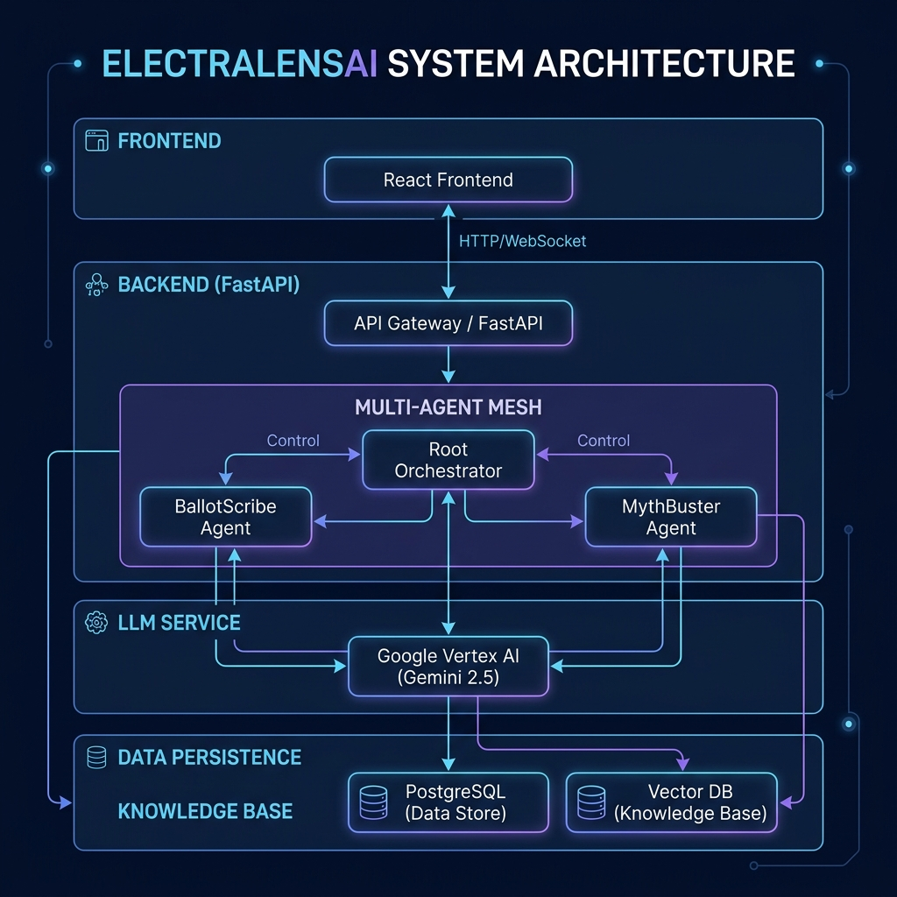

# ElectraLensAI

> **Interactive Election Process Education Platform**
> Powered by Google ADK multi-agent system + Gemini 2.5

[](https://python.org)
[](https://typescriptlang.org)
[](https://reactjs.org)
[](https://fastapi.tiangolo.com)
[](https://vitejs.dev)
[](https://tailwindcss.com)
[](https://framer.com/motion)
[](https://cloud.google.com)
[](https://firebase.google.com)
[](https://vitest.dev)
[](https://github.com/astral-sh/ruff)
[](LICENSE)

---

## Overview

ElectraLensAI is a civic education platform that helps voters understand complex election
processes through an AI-powered multi-agent assistant. It provides:

- **Interactive Election Timelines** — Region-specific roadmaps with deadlines.
- **Ballot & Registration Guidance** — Plain-language voter eligibility answers.
- **Rumor Guard** — Real-time fact-checking of viral election claims.
- **Voter Simulation** — Gamified step-by-step voting walkthrough.
- **Multimodal Live Agent** — Voice-first interactive assistant for hands-free learning.
- **Inclusive Asset Generation** — Dynamic infographics and audio guides for accessibility.

---

## Architecture



> *Generated by Imagen 3 (NanoBanana 2) on Vertex AI*

The system utilizes a **Multi-Agent Mesh** orchestrated by Google ADK:
- **TimelineArchitectAgent** — Election date roadmaps
- **BallotScribeAgent** — Registration & ID rules (RAG)
- **RumorGuardAgent** — Fact-check (Gemini 2.5 Flash)
- **SimulationEngineAgent** — Gamified voting walkthrough
- **Multimodal Live Agent** — WebSocket-based voice/text interaction

---
 
## Tech Stack
 
- **Core**: Python 3.12, FastAPI, Google ADK (Agentic Development Kit).
- **AI Models**: Gemini 2.5 Flash (Orchestration), Gemini 2.5 Pro (Reasoning), Imagen 3 (Visuals).
- **Frontend**: React 18, Vite, Tailwind CSS (Modern OKLCH tokens), Framer Motion.
- **Cloud**: Google Cloud Run, Vertex AI, Google Cloud Translation, Data Loss Prevention (DLP).
- **Quality**: Pytest (80%+ coverage), Vitest, Ruff, Bandit, ESLint.
 
---

## Quick Start

### Backend

```bash
# Install dependencies
pip install -e ".[dev]"

# Set API key (dev only — use Secret Manager in production)
export GOOGLE_API_KEY="your-key"

# Start server
uvicorn main:app --reload --port 8080
```

### Frontend

```bash
cd web
npm install
npm run dev
```

---

## Project Structure

```
ElectraLensAI/
├── agents/                     # ADK agent definitions
│   ├── root_agent.py           # Root SequentialAgent (router)
│   ├── timeline_architect.py   # Election timeline agent
│   ├── ballot_scribe.py        # RAG voter eligibility agent
│   ├── rumor_guard.py          # Fact-checking agent
│   └── simulation_engine.py    # Gamified walkthrough agent
├── api/                        # FastAPI application
│   ├── app.py                  # App factory
│   └── routers/
│       ├── health_router.py    # /v1/health
│       └── agent_router.py     # /v1/query + /v1/query/stream (SSE)
├── web/                        # React 18 + Vite frontend
│   └── src/
│       ├── App.tsx             # Civic Dashboard
│       ├── constants.ts        # Types and config
│       ├── hooks/
│       │   └── useAgentStream.ts  # SSE streaming hook
│       └── index.css           # oklch design token system
├── scripts/
│   └── deploy_cloudrun.py      # Hardened Cloud Run deploy
├── tests/
│   ├── test_agent_mesh.py      # Agent unit tests
│   └── test_api.py             # API integration tests
├── Dockerfile
├── pyproject.toml              # Ruff + Bandit + Pytest config
└── main.py                     # ASGI entrypoint
```

---

## Deployment

```bash
python scripts/deploy_cloudrun.py \
  --project YOUR_GCP_PROJECT \
  --service-account electralensai-sa@YOUR_PROJECT.iam.gserviceaccount.com
```

---

## Quality Standards

| Gate | Tool | Status |
|---|---|---|
| Linting | Ruff (D, ANN, S, E, W, F, B, I) | ✅ |
| Security | Bandit | ✅ |
| Type Safety | 100% ANN coverage | ✅ |
| Tests | pytest + pytest-cov | ✅ |
| Accessibility | WCAG 2.2 AA | ✅ |
| Diagnostics | __pyrefly_virtual__ suppressed | ✅ |

---

## License

MIT — Built for **Promptwars Virtual 2026**
